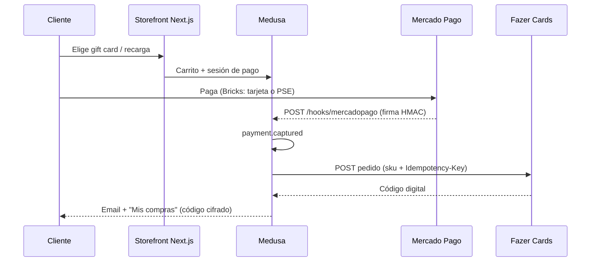

# Gorumin , POC de tienda online de videojuegos

Monorepo de **[gorumin.com](https://gorumin.com)**: una prueba de concepto de e-commerce de **gift cards y recargas de videojuegos** (Steam, PlayStation, Xbox, etc.).

El objetivo de esta POC es demostrar un flujo real de punta a punta:

1. El catálogo y los códigos digitales salen de **[Fazer Cards](https://api.fzr.cards)** (`api.fzr.cards/api/v2`), el proveedor mayorista de tarjetas.
2. El cliente paga en Colombia con **[Mercado Pago](https://www.mercadopago.com.co)** (Checkout Bricks: tarjeta y PSE).
3. Cuando el pago se captura, el backend pide el código a Fazer, lo guarda cifrado y lo entrega al comprador (cuenta + email).

**Repositorio:** [github.com/arjul1989/rumingames](https://github.com/arjul1989/rumingames)

## Cómo se construyó (IA)

Esta POC se desarrolló con **asistencia de IA** (Cursor / agentes de código) como acelerador: integración de APIs, módulos Medusa, checkout, webhooks, admin y despliegue.

El trabajo humano se concentró en el producto y en las decisiones de negocio: proveedor de inventario (Fazer Cards), cobro (Mercado Pago), mercado Colombia (COP), entrega digital y operación (admin, emails, mocks locales). El código que queda en el repo es el entregable: clientes tipados, proveedores de pago, webhooks firmados, fulfillment idempotente y storefront usable.

Sirve como evidencia de que se puede **montar un comercio digital operable con IA**, no un mock de slides: hay APIs reales, estados de orden, reintentos y un camino de compra que se puede ejecutar.

## Qué resuelve

Una tienda de códigos digitales no puede “enviar un paquete”. Tiene que:

- **Comprar al mayorista** el SKU correcto (gift card o top-up) sin duplicar pedidos.
- **Cobrar al cliente** de forma segura y conciliar el webhook del PSP.
- **Entregar el PIN/código** solo después de un pago capturado, cifrado en base de datos.
- **Operar** catálogo, saldo del proveedor, reembolsos y reintentos de entrega desde un admin.

Gorumin cubre ese circuito como POC listo para enseñar a una empresa.

## Flujo de compra



Si Fazer tarda, un webhook en `POST /hooks/fazer` actualiza la entrega cuando el código queda `completed`.

Opcional (feature flag `FUNDING_ENABLED`): fondear el costo mayorista **por transacción** (Fazer `POST /payments` + Binance) antes de emitir, en lugar de usar saldo prepagado. Detalle: [`docs/funding/binance-per-order-funding.md`](docs/funding/binance-per-order-funding.md).

## Integración Fazer Cards (inventario)

Cliente tipado contra **Fazer Cards API v2** (`https://api.fzr.cards/api/v2`), autenticado con `X-Api-Key`.

| Capacidad | Dónde |
|-----------|--------|
| Catálogo gift cards y top-ups, precios mayoristas USD | `apps/medusa/src/modules/fazer/` |
| Sync de catálogo (job diario + admin) | `apps/medusa/src/jobs/sync-fazer-catalog.ts` |
| Pedido de código (`createOrder` / `getOrder`) con idempotencia | fulfillment tras pago capturado |
| Saldo, ofertas, wallet top-up | rutas `/admin/fazer/*` |
| Webhook de estado de orden | `POST /hooks/fazer` |

Tras el cobro, `payment.captured` dispara el fulfillment digital: mapeo SKU Fazer → variante Medusa → pedido al proveedor → fila `digital_delivery` (`pending` → `processing` → `delivered` / `failed`).

Códigos en reposo: cifrados (`DIGITAL_CODE_ENCRYPTION_KEY`). El storefront los revela solo al dueño de la orden.

## Integración Mercado Pago (venta)

Proveedor de pago Medusa v2 (`pp_mercadopago_mercadopago`), pensado para **Colombia (es-CO / COP)**.

| Capacidad | Dónde |
|-----------|--------|
| Provider Medusa (authorize / capture / refund / cancel) | `apps/medusa/src/modules/payment-mercadopago/` |
| Checkout Bricks en el storefront | `@mercadopago/sdk-react` |
| Webhook de pagos (firma `x-signature`, idempotente) | `POST /hooks/mercadopago` |
| Settings públicas (public key, métodos) | `GET /store/mercadopago/settings` |
| Admin de pagos / reembolso | `/admin/payments/mercadopago`, refund por orden |

El webhook **no confía en el body a ciegas**: verifica firma, filtra eventos `payment`, deduplica y deja que Medusa capture. Esa captura es el gatillo de Fazer.

En local se puede simular cobro y emisión sin PSP ni mayorista reales (`MOCK_MP`, `MOCK_FAZER`). Guía: [`docs/dev-mocks.md`](docs/dev-mocks.md).

## Stack

| Capa | Tecnología |
|------|------------|
| Commerce / admin | **Medusa v2** (Node 20, PostgreSQL, Redis) |
| Tienda | **Next.js 15** (App Router), región `/co` |
| Pagos | Mercado Pago (POC principal); Wompi y ePayco también están cableados |
| Inventario digital | Fazer Cards API v2 |
| Email | Brevo |
| Infra | GCP Cloud Run (sandbox + producción). Ver [`docs/infra/environments.md`](docs/infra/environments.md) |

Arquitectura **headless**: Medusa expone Store/Admin/hooks; el storefront actúa de BFF (`/api/*`, cookie httpOnly). APIs: [`docs/api/README.md`](docs/api/README.md). Colección Postman: [`docs/postman/`](docs/postman/).

## Estructura del repo

```
apps/medusa/          Backend Medusa v2, módulos Fazer / Mercado Pago / delivery
apps/storefront/      Tienda Next.js (gorumin.com)
packages/types/       Tipos compartidos (@gorumin/types)
docs/                 APIs, mocks, infra, funding
infra/gcp/            Deploy Cloud Run
scripts/              Utilidades (Jira, webhooks sandbox)
```

## Requisitos locales

- Node.js 20+
- pnpm 10+
- PostgreSQL 15+
- Redis

## Setup

```bash
git clone https://github.com/arjul1989/rumingames.git
cd rumingames
pnpm install

cp .env.example apps/medusa/.env
cp apps/storefront/.env.template apps/storefront/.env.local

createdb gorumin_medusa
cd apps/medusa && pnpm medusa db:migrate
pnpm medusa user -e admin@gorumin.com -p supersecret
```

Arrancar Medusa → `http://localhost:9000/app` · Health → `http://localhost:9000/health`

Crear publishable API key en Medusa Admin → Settings, luego en `apps/storefront/.env.local`:

```
NEXT_PUBLIC_MEDUSA_PUBLISHABLE_KEY=pk_...
```

Para el circuito Fazer + Mercado Pago, en `apps/medusa/.env`:

```
FAZER_API_KEY=
MP_ACCESS_TOKEN=
MP_PUBLIC_KEY=
MP_WEBHOOK_SECRET=
DIGITAL_CODE_ENCRYPTION_KEY=
```

Sin credenciales reales, usa mocks (`MOCK_MP=true`, `MOCK_FAZER=true`). Ver [`.env.example`](.env.example).

```bash
pnpm dev              # backend + storefront
pnpm medusa:dev       # solo Medusa (9000)
pnpm storefront:dev   # solo storefront (8000)
```

Storefront: `http://localhost:8000/co`

## Demo rápida para revisión

1. Levantar Medusa + storefront (con mocks o sandbox).
2. Elegir un producto de catálogo Fazer (gift card / recarga).
3. Pagar con Mercado Pago (Bricks) o aprobar en el simulador `/dev/mock-mp`.
4. Ver la orden capturada, la entrega digital y el código en **Mis compras** (y el email si Brevo está configurado).
5. En admin: saldo Fazer, sync de catálogo, entregas y reembolso MP.

## Más documentación

| Tema | Doc |
|------|-----|
| APIs BFF / Store / Admin / webhooks | [`docs/api/README.md`](docs/api/README.md) |
| Mocks Mercado Pago + Fazer | [`docs/dev-mocks.md`](docs/dev-mocks.md) |
| Entornos local / sandbox / prod | [`docs/infra/environments.md`](docs/infra/environments.md) |
| Fondeo por orden (Fazer + Binance) | [`docs/funding/binance-per-order-funding.md`](docs/funding/binance-per-order-funding.md) |

Épicas e historias (proyecto **RUM**): [tablero Jira](https://rumin.atlassian.net/jira/software/projects/RUM/boards/1)

## Licencia

MIT , basado en [Medusa DTC Starter](https://github.com/medusajs/dtc-starter).
