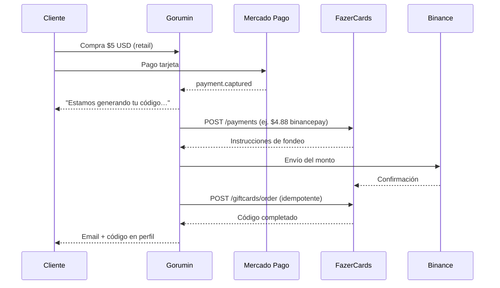

# Épica 13 — Fondeo por transacción (FazerCards + Binance)

## Objetivo

Financiar **cada compra de forma individual** en la cuenta mayorista de FazerCards antes de emitir el código digital. El cliente paga en Gorumin (Mercado Pago); Gorumin fondea el costo mayorista vía Binance y luego solicita la tarjeta/código a Fazer.

## Flujo operativo



## Historias de usuario

### US-13.1 — Orquestación backend fondeo → emisión

**Como** sistema Gorumin, **quiero** tras cada `payment.captured` crear un fondeo Fazer por el costo mayorista exacto, pagarlo vía Binance y solo entonces emitir el producto, **para** no mantener saldo prepagado en Fazer.

**Criterios de aceptación**

- Tras pago capturado, por cada línea digital mapeada a Fazer se crea un `funding_run` idempotente (`order_id:line_item_id`).
- Se calcula `wholesale_usd` desde el mapping/oferta Fazer (ej. $4.88 para venta retail $5).
- `POST /payments` en Fazer con método configurable (`binancepay` por defecto).
- Binance ejecuta el pago según instrucciones (`pay_to`, `pay_url`, etc.).
- Se hace poll de `GET /payments/{id}` hasta estado confirmado o timeout configurable.
- Solo entonces `createOrder` en Fazer y entrega del código (email + `digital_delivery`).
- Reintentos acotados; fallos alertan admin y marcan delivery `failed`.
- Feature flag `FUNDING_ENABLED=false` conserva el flujo actual (saldo Fazer existente).

### US-13.2 — UX cliente: compra en proceso

**Como** comprador, **quiero** ver que mi pedido está siendo procesado con un mensaje claro, **para** confiar mientras se fondea y genera el código.

**Criterios de aceptación**

- Checkout éxito: mensaje tipo *"Estamos generando tu código. En unos minutos lo recibirás en tu correo."*
- Perfil → Mis compras: badge *En proceso* mientras `processing` / fondeo activo.
- Detalle de orden: texto tranquilizador; no mostrar error si aún está en curso.
- Cuando llega el código: estado *Entregado* + revelar código como hoy.

### US-13.3 — Cliente Binance

**Como** operador, **quiero** credenciales Binance en variables de entorno, **para** automatizar el envío de fondos sin intervención manual.

**Criterios de aceptación**

- Variables documentadas en `.env.example` y `apps/medusa/.env.template`.
- Cliente Binance aislado con firma HMAC (API key/secret o Binance Pay merchant).
- Modo mock en dev (`MOCK_BINANCE=true`) sin enviar dinero real.
- Logs sin secretos ni direcciones completas en producción.

### US-13.4 — API Fazer payments

**Como** desarrollador, **quiero** métodos tipados para `/payments` en el cliente Fazer, **para** crear y consultar fondeos por transacción.

**Criterios de aceptación**

- `listPaymentMethods()`, `createPayment()`, `getPayment()` en `FazerClient`.
- Idempotency-Key por `funding_run`.
- Errores tipados (`FazerApiError`) propagados al orquestador.

### US-13.5 — Persistencia y observabilidad

**Como** operador, **quiero** trazabilidad de cada fondeo, **para** auditar y reintentar fallos.

**Criterios de aceptación**

- Tabla `funding_run` con estados: `pending` → `fazer_payment_created` → `binance_sent` → `fazer_payment_confirmed` → `fazer_order_placed` → `completed` | `failed`.
- Admin puede ver estado (fase 2: pantalla admin; fase 1: logs + DB).
- Alerta admin en fallo de fondeo o Binance.

### US-13.6 — Límites y seguridad

**Como** negocio, **quiero** topes por orden y buffer de balance, **para** evitar fondeos accidentales grandes.

**Criterios de aceptación**

- `FUNDING_MAX_USD_PER_ORDER` rechaza fondeos mayores (marca failed + alerta).
- Verificación opcional de balance Binance antes de enviar.
- Credenciales solo server-side; nunca en storefront.

## Variables de entorno

Ver sección *Fondeo Binance* en `.env.example` y `apps/medusa/.env.template`.

## Jira

```bash
export JIRA_API_TOKEN=...
python3 scripts/seed-jira-funding-epic.py
```

Board: https://rumin.atlassian.net/jira/software/projects/RUM/boards/1
